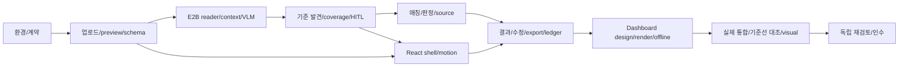

# 구현 PLAN / 의존 DAG / 증거

각 milestone은 [CURRENT_REPRODUCTION](REPRODUCTION.md)의 선행 gate 통과 후 완료한다. OPTIONAL_FUTURE의 기능·DTO·상한·모델 호출을 추가하지 않는다. UI 스텁이나 fake API로 다음 단계를 탐색할 수 있으나 해당 milestone의 실제 통과로 기록하지 않는다. source filename은 추천 모듈 경계이며 함수 이름·파일 분할은 달라도 외부 계약은 같다.



| milestone | 산출물·책임 | 필수 검증 / 종료 조건 |
|---|---|---|
| M0 | package locks, env reader, launch/build/assets, config redaction; integration clients | npm ci 두 위치, 설정 검사. 누락키 에러, 브라우저 키 0. bootstrap은 제품 완료 아님 |
| M1 | upload/memory store/source coordinates, local preview, HTTP error schema, SSE replay; contracts 타입 | 업로드 서명/확장자/용량/경로 공격, source validation, server restart 소실. API fixtures 직렬화 |
| M2 | bounded pools, E2B isolated document session, reader structure/coverage/context repair, VLM transcription/requery | partial/timeout/cancel/late result, 설치1회/같은 repair session 증거. 실제 한 PDF와 multi-sheet XLSX 읽기 |
| M3 | eligibility/notes/condition/revision criteria discovery, hierarchy optional, edit/revise/confirm/version | 무유형, 다단계, 혼재·전치·블록·개정·대체·qualitative, source coverage. stale request409 및 confirm gate |
| M4 | independent extraction/semantic match/deterministic evaluation/applicability/missing | unit+boundary+conditions, confirmed missing fail vs uncertainty review, 현재 source guard/row coverage 및 알려진 미검증 분기 대조 |
| M5 | landing→criteria→process page→confirm→targets React shell, event motion/queue/reduced-motion | 참조 viewport와 현재 반응형 동작, 실제 이벤트 trace 대응, burst/cancel/unmount 및 컴포넌트별 모션 처리 대조 |
| M6 | file results/detail/source immediate, human audit, export 3 formats, ledger mapping | original/machine/human 값 구분, CSV formula escaping, ledger base workbook 보존, download cross-count |
| M7 | dashboard modal lazy, 14 design settings+baseDesign, fixed renderer, chart offline bundle, E2B repair | all choices/schema, data unchanged, no external request offline, no raw document, error fallback truthful |
| M8 | public baseline comparison + live providers + all reference visual comparison | 06 CURRENT_REPRODUCTION gate. 실행 input/code/artifact hashes, 미실행 통과 금지, 독립 observer/browser 증거 |
| M9 | clean-room install, package reference audit, 현재 accessibility/perf 대조, reviewer findings resolved | 미해결 재현 이슈=0, 모든 현재 profile 필수 gate pass; 최종 evidence와 한계 |

## 모듈 의존과 데이터 소유

`integrations`만 API 키를 읽고 Gemini/E2B SDK를 호출한다. server의 document store가 원본 Buffer를 소유하고 serializable metadata만 UI에 보낸다. `analysis`는 원본+reader inventory에서 context/coverage를 만든다. `criteria`는 sources에서 후보+provenance를 만들며 `review engine`은 승인 snapshot만 사용한다. normalization/evaluator/conditions/source checks는 UI 없이 테스트할 수 있다. 일부 정규화·조건 복구 helper는 입력 객체를 변경하므로, 순수 함수라고 가정하지 말고 소유 명세의 복사·변이 경계를 지킨다. API는 transition/version guard 후 engine에 위임한다. SSE는 mutation 완료 상태의 snapshot/event를 발행한다. UI는 source facts를 고치지 않고 사용자 수정 API만 호출한다. dashboard/ledger/export는 engine의 frozen outcome과 human audit를 읽는다.

## checkpoint 포맷

`.cache/rebuild/state.json`은 임시 파일에 쓴 후 atomic rename. 다음 키를 반드시 저장한다.

```json
{
  "schemaVersion":1,"objective":"GSPEC current reproduction","acceptanceProfile":"CURRENT_REPRODUCTION","status":"in_progress",
  "milestone":"M0","completedMilestones":[],"sourceDigest":"sha256-of-current-implementation",
  "packageManifestDigest":"sha256-of-architecture-package-manifest",
  "lastGate":null,"nextCommand":"npm ci","openIssues":[],
  "ownedProcesses":[],"updatedAt":"ISO-8601","evidenceIndex":"evidence/index.json"
}
```

각 명령은 command/cwd/start/end/exitCode/input hashes/code hash/stdout-log/artifacts/status를 evidence JSONL에 추가한다. 키·전체 업로드 원문·authorization header는 기록하지 않는다. `status`는 planned/running/pass/fail/blocked/unrun. 상태파일 완료 여부가 test exit code를 덮지 않는다. UI synthetic screenshot과 live-service screenshot을 origin 필드로 구분한다.

## 반복 수정과 중단 기준

1. 좁은 실패 재현 fixture와 예상/실제를 저장한다.
2. 원인을 parser/context/matching/evaluator/source/UI/infra로 분류한다.
3. 사례 ID/파일명/고정 cell에 의존한 if를 추가하지 않는다. 일반 규칙과 metamorphic test로 수정한다.
4. 영향 테스트→해당 gate→인접 gate 순으로 재실행한다. 다른 코드 해시의 pass를 무조건 재사용하지 않는다.
5. 반복 실패는 이유/가설/시도를 기록. 공급자 제한이면 backoff·키/설정 확인 후 blocked/unrun으로 정직하게 보고한다. timeout을 pass로 바꾸지 않는다.
6. milestone마다 독립 reviewer가 예상과 증거를 대조한다. reviewer는 점수 외 구체적 file/section/불명확 행동/고칠 계약을 제출한다.

다음 중 하나라도 있으면 완료 금지: 현재 profile 필수 gate 미실행, API/E2B 실제 증거 없음, 기준선과 다른 입력, profile 누락/혼합, 허용되지 않은 판정·출처·화면 차이, 판정 데이터가 바뀐 dashboard, 패키지 밖 원본을 읽어야만 구현 가능한 계약, 미해결 재현 이슈. 현재 제품의 알려진 결함과 새 구현의 차이를 구별한다. 서버/키/권한 같은 외부 장애는 상세 기록 후 필요한 조치를 보고하되 허위 성공으로 끝내지 않는다.
