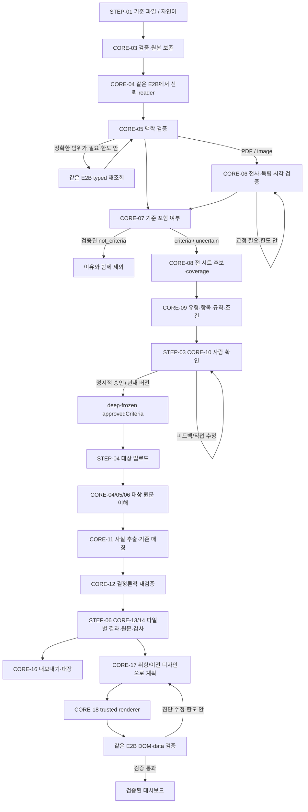

# GSPEC core 기능 분해와 재현 경계

기준일: 2026-09-21. 이 문서는 실제 구현의 **책임·입출력·의존 관계·검증 위치**를 분해한 지도다. UI 시각 모듈 목록과 별도로 읽는다. 원본 코드를 읽지 않는 독립 평가자는 [core-modules.json](core-modules.json)의 현재 21개 모듈, 123개 이진 질문에 대해 설계 문서의 구체적 문장·schema·사례를 인용해야 한다. 과거 R1의 18개/90개에서 CORE-19 추가 후 19개/95개가 됐고 이후 CORE-20/21과 누락 질문을 보강했다. **분해 목록 자체가 통과 증거는 아니며 최신 점수는 독립 검토 보고서에 한정한다.**

`sourceFiles`는 프로젝트 루트 상대 경로, `specFiles`는 `architecture/` 상대 경로다. 같은 source 파일이 여러 모듈에 나타나는 것은 현재 구현이 `server/review.mjs`·`server/app.mjs`에 여러 책임을 담기 때문이다. 재현 구현의 파일 배치가 반드시 같아야 한다는 뜻은 아니다. `dependencies`는 기능·서비스 의존성이며 빌드 위상 정렬용 DAG가 아니다. 아래의 실제 import 인접 목록과 구별한다.

## 1. 화면 step과 core 소유권

| 논리 step | 진입/산출물 | core 담당 |
|---|---|---|
| STEP-00 intro | 소개와 시연 시작 | 시각 UI 소유. 예제 데이터 선택만 CORE-16 |
| STEP-01 criteria-input | 기준 파일 또는 자연어 입력 → 저장된 기준 source ID/요청 | CORE-02, 03, 16 |
| STEP-02 criteria-analysis | 원본 읽기·맥락 검증·자격 판별·전 시트 기준 탐색 → 후보+coverage | CORE-01, 04, 05, 06, 07, 08, 09, 13, 15 |
| STEP-03 criteria-confirm | 파일/유형별 후보 수정·피드백 → 버전 고정 승인본 | CORE-09, 10, 13, 14 |
| STEP-04 targets | 승인 후 대상 파일 첨부 → run의 검토 대상 | CORE-02, 03, 10, 13, 16 |
| STEP-05 review | 대상 원문 읽기·facts·매칭·재판정 → 파일별 판정+coverage | CORE-01, 04, 05, 06, 09, 11, 12, 13, 15 |
| STEP-06 results | 원본/판정·사람 수정·내보내기·대장·대시보드 | CORE-12, 13, 14, 16, 17, 18; 작업 시 CORE-01, 04, 05, 15 |

앱의 보이는 진행 표시 4개와 논리 step 7개는 같다: `01 기준 입력=STEP-01`, `02 기준 확인·확정=STEP-02/03`, `03 검토 파일 입력=STEP-04`, `04 파일별 결과=STEP-05/06`. 대시보드와 검토대장은 STEP-06의 선택 기능이며 승인 절차를 우회하는 별도 검토 엔진이 아니다.

## 2. 책임 트리

```text
GSPEC
├─ 실행 경계
│  ├─ CORE-01 설정 / LLM·E2B 어댑터 / provider 오류
│  ├─ CORE-02 로컬 HTTP API / 메모리 저장소 / 공개·비공개 DTO
│  ├─ CORE-03 업로드 / 서명·archive 검사 / 원본 보존 / 로컬 미리보기
│  └─ CORE-15 FIFO 자원 / 실제 task·명령 이벤트 / SSE / 인과 handoff
├─ 문서 이해: 기준·대상·대장의 공용 파이프라인
│  ├─ CORE-04 같은 문서의 E2B 수명 / 신뢰 Python reader
│  ├─ CORE-05 구조·헤더·영역 검증 / typed 원본 재조회 / 교정 루프
│  └─ CORE-06 PDF·image 전사 / 독립 visual judge / 배치 coverage
├─ 기준 확정
│  ├─ CORE-07 규범 여부 / 검증된 비기준서 제외
│  ├─ CORE-08 workbook inventory / 영역별 탐색 / 전 시트 coverage
│  ├─ CORE-09 규칙·단위·조건·분류·범위 / 비고 제외 / 중복·대체
│  └─ CORE-10 사용자 수정 / 자연어 피드백 / version / freeze / 승인
├─ 대상 검토
│  ├─ CORE-11 독립 facts / 자료·항목 매칭 제안 / record coverage
│  ├─ CORE-12 숫자·단위·조건·적용 분류 / 누락과 불확실성 / 최종 판정
│  └─ CORE-13 run·문서 상태 / 작업 조정 / 부분 실패 / 취소 / 감사
└─ 결과 활용
   ├─ CORE-14 source evidence / 항목 앵커 / 파일별 전체 하이라이트
   ├─ CORE-16 결과 JSON·CSV·XLSX / 확인한 대장 복사본 / 예제 카탈로그
   ├─ CORE-17 자연어 presentation plan / 이전 취향 유지 / 수정 루프
   └─ CORE-18 신뢰 React 차트 / HTML 렌더 / DOM·data 검사 / offline export
```

| ID | 책임 | step | 기능 의존 |
|---|---|---|---|
| CORE-01 | 설정과 외부 서비스 어댑터 | `STEP-02`, `STEP-05`, `STEP-06` | — |
| CORE-02 | 로컬 HTTP API와 메모리 저장소 경계 | `STEP-01`, `STEP-02`, `STEP-03`, `STEP-04`, `STEP-05`, `STEP-06` | CORE-01 |
| CORE-03 | 업로드 검증과 원본 보존·로컬 미리보기 | `STEP-01`, `STEP-04`, `STEP-06` | CORE-02 |
| CORE-04 | 같은 샌드박스의 신뢰 문서 리더 | `STEP-02`, `STEP-05`, `STEP-06` | CORE-01, CORE-03, CORE-15 |
| CORE-05 | 문서 맥락 검증과 범위 재조회 루프 | `STEP-02`, `STEP-05`, `STEP-06` | CORE-04, CORE-01 |
| CORE-06 | PDF·이미지 시각 전사와 독립 판독 검증 | `STEP-02`, `STEP-05` | CORE-04, CORE-01, CORE-15 |
| CORE-07 | 기준 문서 자격 판별과 제외 | `STEP-02`, `STEP-03` | CORE-05, CORE-06, CORE-01 |
| CORE-08 | 전 시트 기준 탐색·영역 coverage | `STEP-02`, `STEP-03` | CORE-07, CORE-01, CORE-15 |
| CORE-09 | 기준 정규화·분류 계층·비고 정책 | `STEP-02`, `STEP-03`, `STEP-05` | CORE-08, CORE-07 |
| CORE-10 | 기준 HITL 편집·피드백·버전 승인 | `STEP-03`, `STEP-04` | CORE-09, CORE-13 |
| CORE-11 | 독립 항목 추출과 의미 기반 기준 매칭 | `STEP-05` | CORE-06, CORE-10, CORE-05 |
| CORE-12 | 결정론적 판정·필수 누락·불확실성 | `STEP-05`, `STEP-06` | CORE-11, CORE-09 |
| CORE-13 | 검토 실행 상태·작업 조정·취소·감사 | `STEP-02`, `STEP-03`, `STEP-04`, `STEP-05`, `STEP-06` | CORE-02, CORE-15 |
| CORE-14 | 원문 근거 연결과 하이라이트 무결성 | `STEP-03`, `STEP-06` | CORE-12, CORE-09 |
| CORE-15 | 실제 작업 이벤트·인과 handoff·동시성 | `STEP-02`, `STEP-05`, `STEP-06` | CORE-01 |
| CORE-16 | 결과 내보내기·검토대장 복사본 기입·예제 카탈로그 | `STEP-01`, `STEP-04`, `STEP-06` | CORE-03, CORE-12, CORE-13 |
| CORE-17 | 대시보드 의미 설계·사용자 취향·수정 루프 | `STEP-06` | CORE-13, CORE-01, CORE-15, CORE-18 |
| CORE-18 | 신뢰 대시보드 렌더러·오프라인 차트·검증 | `STEP-06` | CORE-12 |
| CORE-19 | 자료구조·복잡도·큐·캐시·취소·자원 효율 | 모든 STEP | CORE-01/03/04/05/08/12/13/15/18, UI-01/09/10/11/15 |

## 3. 실행 순서와 루프 경계



자연어만으로 기준을 넣으면 문서 reader/자격/워크북 탐색 단계 없이 모델 기준 정리 → 동일 정규화·HITL로 들어간다. XLSX 이외의 기준 원문은 일반 기준 추출을 사용하며 workbook 전용 탐색을 호출하지 않는다.

| 루프/큐 | 현재 구현의 경계 | 성공·중단 후 의미 |
|---|---|---|
| 문서 맥락 교정 | 최대 3회; 문서 세션 deadline 300초; 초기 읽기·재조회는 같은 물리 E2B, 로컬 명령 큐 1 | 검증 통과 또는 미해결 issues/partial; 무한 재시도 없음 |
| 시각 전사 교정 | 최대 3회; 3페이지 배치, 최대30페이지, 전체180초/요청60초 | 독립 검증과 coverage를 함께 보존; 전사 complete만으로 완료 금지 |
| XLSX 기준 탐색 | 별도 workbook E2B에서 최대2회 상세 추출; 범위/셀/문자/후보 상한 | 영역별 미확인 범위·제외 이유·한도 노출 |
| 기준 피드백 | 명시적 사용자 요청당 수정; run 최대20회; 재확인 후 승인 | 기준 버전 증가, 이전 draft/feedback audit; 사람 승인 자동 생성 금지 |
| 대시보드 계획/교정 | 최대3번 계획 시도; 검증 구간의 동일 E2B/설치1회 | 검증된 ready 또는 분명하게 표시한 기본 fallback/실패 |
| LLM/E2B 자원 | 각각 process-wide active2/pending100 FIFO; ReviewEngine 자체 ModelQueue2 | abort가 실제 작업·정리 종료 전에 slot을 반납하지 않음 |
| 문서 worker | analyzeInputs 2 worker; reviewDocuments 2 worker | 한 문서 실패를 다른 문서 실패로 전파하지 않음 |

**E2B 재사용 범위가 핵심이다.** `withSandbox`는 callback마다 생성하고 마지막에 종료하는 어댑터다. 문서 맥락 루프는 retained runner를 통해 같은 세션을 사용한다. 기준 workbook 탐색과 대시보드 검증은 각각 자기 수명을 갖는다. 모든 단계/모든 run이 영구적으로 단일 sandbox를 공유하는 구현은 현재 동작이 아니다.

## 4. 재현 불변식

1. 기본 제품 저장소는 **RAM**이다. DocumentStore 원본 Buffer·ReviewEngine runs·activity tasks·dashboard jobs가 메모리에 존재한다. 임시 개발용 보존 서버가 있더라도 제품의 디스크 영속 저장 계약으로 옮기지 않는다.
2. 원본 bytes는 수정하지 않는다. ExcelJS 호환 처리와 대장 기입은 복제본에만 적용한다.
3. 문서 문자열·파일명·댓글·인용은 도구 명령이 아니다. LLM에 실행 도구를 주지 않고 typed selector 또는 제한된 plan만 받는다.
4. 전체 읽기/범위 검증이 불완전하면 partial·uncertain·needsConfirmation을 유지한다. 범용성은 임의 파일에 대한 완전 자동 성공을 뜻하지 않는다.
5. 유형이 없는 문서는 정상적으로 `categoryPath:[]/not_applicable`일 수 있다. 유형이 있는 경우 모든 필요한 상위·하위 단계와 sample은 실제 대상 근거를 요구한다.
6. `비고/notes/remarks`는 기준 판정 조건에서 제외한다. 별도의 실제 조건 열/본문 조건은 보존한다.
7. 필수 결과의 **확정 누락**은 fail이다. 판독불가·화질·누락 여부 불확실·수식 미캐시·잘림은 review다. 누락 항목의 header/시료명에 가짜 하이라이트를 만들지 않는다.
8. 검토 수치·근거·status와 사용자 presentation 취향은 별개다. 대시보드 모델은 HTML/JS/수치 대신 검증된 14-field plan만 반환한다.
9. UI 명칭은 LLM/샌드박스여도 wire runtime 값은 `gemini/e2b`다. 기록은 실제 서비스 작업을 표현하고 관측하지 못한 사고 과정이나 진행률을 만들지 않는다.
10. golden의 카탈로그 ID는 예제 로딩 allowlist일 뿐 판정 규칙이 아니다. **ralph-golden-v3 전용 카탈로그 UI는 현재 없다.** 해당 원본은 직접 업로드/검증으로 사용한다. 정답 파일은 모델 입력이나 runtime 판단 근거에 넣지 않는다.
11. 도넛 요구는 Chart.js 구버전 2.x가 아니라 **react-chartjs-2 5.3.1 + Chart.js 4.5.1**의 신뢰된 React 컴포넌트로 구현한다.
12. DOM 검사 통과는 픽셀 품질/실제 상세 가시성 통과와 다르다. 독립 browser QA가 필요하다.

## 5. source-grounded import 인접 목록

아래는 R1 CORE-01..18이 참조한 59개 source 파일의 정적 local `import/export from`을 읽어 얻은 인접 목록이다. CORE-19 추가 후 전체 registry의 고유 source는 61개이며 자원 효율의 세부 연결은 [07](../specs/07-data-algorithms-concurrency.md)과 [효율 목록](../contracts/efficiency-inventory.json)이 소유한다. NPM/Node builtin edge는 각 모듈 `libraries` 및 lockfile에 정의한다. 타입 import는 실행 의존성과 다를 수 있다. 확장자를 생략한 TypeScript import는 source 표기대로 남겼다.

```text
integrations/src/command-progress.mjs
  -> integrations/src/activity.mjs

integrations/src/config.mjs
  -> integrations/src/errors.mjs

integrations/src/gemini.mjs
  -> integrations/src/config.mjs
  -> integrations/src/errors.mjs
  -> integrations/src/task-pool.mjs

integrations/src/index.mjs
  -> integrations/src/config.mjs
  -> integrations/src/gemini.mjs
  -> integrations/src/sandbox.mjs
  -> integrations/src/errors.mjs

integrations/src/sandbox.mjs
  -> integrations/src/config.mjs
  -> integrations/src/errors.mjs
  -> integrations/src/task-pool.mjs
  -> integrations/src/activity.mjs

server/activity.mjs
  -> integrations/src/activity.mjs

server/app.mjs
  -> server/documents.mjs
  -> server/review.mjs
  -> integrations/src/index.mjs
  -> server/dashboard.mjs
  -> server/ledger.mjs
  -> server/golden-catalog.mjs
  -> server/activity.mjs

server/conditions.mjs
  -> server/criteria-notes.mjs

server/criteria-adapter.mjs
  -> server/criteria-notes.mjs

server/criteria-context.mjs
  -> server/criteria-adapter.mjs
  -> server/criteria-notes.mjs
  -> server/criteria-layout.mjs

server/criteria-eligibility.mjs
  -> server/document-quality.mjs

server/criteria-layout.mjs
  -> server/criteria-adapter.mjs

server/criteria-notes.mjs
  -> server/criteria-table-sources.mjs

server/criteria-revision.mjs
  -> server/criteria-notes.mjs
  -> integrations/src/activity.mjs

server/criteria-sandbox.mjs
  -> integrations/src/sandbox.mjs
  -> integrations/src/command-progress.mjs
  -> integrations/src/activity.mjs
  -> integrations/src/gemini.mjs
  -> server/criteria-adapter.mjs
  -> server/criteria-notes.mjs
  -> server/criteria-layout.mjs
  -> server/criteria-context.mjs

server/dashboard-fallback.mjs
  -> server/dashboard-chart-runtime.mjs

server/dashboard-plan.mjs
  -> server/dashboard-fallback.mjs

server/dashboard.mjs
  -> integrations/src/gemini.mjs
  -> integrations/src/config.mjs
  -> integrations/src/sandbox.mjs
  -> integrations/src/command-progress.mjs
  -> integrations/src/activity.mjs
  -> integrations/src/errors.mjs
  -> server/dashboard-fallback.mjs
  -> server/dashboard-plan.mjs
  -> server/dashboard-plan-validation.mjs

server/document-requery.mjs
  -> integrations/src/sandbox.mjs
  -> integrations/src/command-progress.mjs
  -> integrations/src/config.mjs
  -> server/document-quality.mjs
  -> server/document-sandbox-resources.mjs

server/document-sandbox-resources.mjs
  -> integrations/src/command-progress.mjs

server/documents.mjs
  -> server/spreadsheet-xml-compatibility.mjs

server/field-extraction.mjs
  -> integrations/src/index.mjs

server/golden-catalog.mjs
  -> server/documents.mjs

server/index.mjs
  -> server/app.mjs

server/missing-result.mjs
  -> server/criterion-applicability.mjs
  -> server/document-quality.mjs
  -> server/table-records.mjs

server/review.mjs
  -> integrations/src/index.mjs
  -> server/documents.mjs
  -> server/conditions.mjs
  -> server/criteria-notes.mjs
  -> server/criteria-adapter.mjs
  -> server/field-extraction.mjs
  -> server/table-records.mjs
  -> server/criteria-normalization.mjs
  -> server/sandbox-documents.mjs
  -> server/criteria-sandbox.mjs
  -> server/visual-transcription.mjs
  -> server/criteria-approval.mjs
  -> server/criteria-revision.mjs
  -> server/criterion-applicability.mjs
  -> integrations/src/activity.mjs
  -> server/criteria-eligibility.mjs
  -> server/missing-result.mjs

server/sandbox-documents.mjs
  -> integrations/src/activity.mjs
  -> integrations/src/gemini.mjs
  -> integrations/src/config.mjs
  -> integrations/src/sandbox.mjs
  -> integrations/src/command-progress.mjs
  -> server/document-quality.mjs
  -> server/document-requery.mjs
  -> integrations/src/task-pool.mjs
  -> server/document-sandbox-resources.mjs

server/task-pool.mjs
  -> integrations/src/task-pool.mjs

server/visual-transcription.mjs
  -> integrations/src/index.mjs
  -> integrations/src/activity.mjs
  -> server/visual-quality-judge.mjs

src/components/criterion-preview-evidence.mjs
  -> src/components/source-highlights.mjs

src/components/dashboard-file-scope.mjs
  -> src/components/item-source-highlights.mjs

src/components/file-review-model.mjs
  -> src/components/item-source-highlights.mjs

src/review-state.ts
  -> src/types.ts

src/useReview.ts
  -> src/api
  -> src/review-state
  -> src/types
```

정적 import가 아닌 파일 자원 edge도 재현 대상이다.

| 호출 파일 | 자원 / 방식 |
|---|---|
| server/document-sandbox-resources.mjs | 고정 `sandbox-document-reader.py`, `document-requery.py`를 읽어 같은 sandbox에 업로드 |
| server/criteria-sandbox.mjs | `criteria-workbook-profile.py`를 기준 탐색 sandbox에 업로드 |
| server/dashboard-chart-runtime.mjs | 빌드 산출물 `server/assets/dashboard-chart-runtime.js` 읽기·캐시 |
| scripts/build-dashboard-chart-runtime.mjs | `scripts/dashboard-chart-entry.jsx`를 esbuild로 standalone runtime 빌드 |
| server/documents.mjs | PDF.js 런타임 로딩; 로컬 text preview가 최종 문서 이해를 대체하지 않음 |
| server/golden-catalog.mjs | allowlist된 golden의 원본 xlsx/pdf/png 파일만 읽음 |

이 목록은 source dependency **지도**다. clean-room 구현이 원본 파일을 import해야 한다는 요구가 아니다.

## 6. 모듈별 기존 검증 파일

테스트 파일이 있다는 사실은 이번 설계의 통과 판정이 아니다. 독립 평가자가 요구사항의 입력·출력·오류·경계를 명세만으로 재작성할 수 있어야 한다. 아래 파일은 기존 동작을 대조할 provenance이며 clean-room 실행 계약은 `architecture/validation/`에서 별도로 연결한다.

| 모듈 | 기존 테스트 source |
|---|---|
| CORE-01 | `integrations/test/integrations.test.mjs`<br>`integrations/test/gemini-limits.test.mjs`<br>`integrations/test/concurrency.test.mjs` |
| CORE-02 | `server/app.test.mjs`<br>`server/documents.test.mjs`<br>`server/review.wizard.test.mjs` |
| CORE-03 | `server/documents.test.mjs`<br>`server/spreadsheet-xml-compatibility.test.mjs` |
| CORE-04 | `server/sandbox-documents.test.mjs`<br>`server/document-sandbox-session.test.mjs`<br>`server/document-reader.test.py` |
| CORE-05 | `server/document-quality.test.mjs`<br>`server/sandbox-documents.test.mjs`<br>`server/document-sandbox-session.test.mjs`<br>`server/document-reader.test.py` |
| CORE-06 | `server/visual-transcription.test.mjs`<br>`server/visual-quality-judge.test.mjs`<br>`server/visual-transcription-alignment.test.mjs` |
| CORE-07 | `server/criteria-eligibility.test.mjs`<br>`server/review.eligibility.test.mjs` |
| CORE-08 | `server/criteria-sandbox.test.mjs`<br>`server/criteria-layout.test.mjs`<br>`server/criteria-matrix-regression.test.mjs`<br>`server/criteria-generalization.test.mjs`<br>`server/criteria-context.test.mjs` |
| CORE-09 | `server/criteria-adapter.test.mjs`<br>`server/criteria-notes.test.mjs`<br>`server/criteria-table-sources.test.mjs`<br>`server/conditions.test.mjs`<br>`server/criteria-context.test.mjs`<br>`server/review.classification.test.mjs` |
| CORE-10 | `server/criteria-approval.test.mjs`<br>`server/criteria-revision.test.mjs`<br>`server/review.wizard.test.mjs` |
| CORE-11 | `server/field-extraction.test.mjs`<br>`server/table-records.test.mjs`<br>`server/review.pipeline.test.mjs`<br>`server/review.integration.test.mjs` |
| CORE-12 | `server/missing-result.test.mjs`<br>`server/criterion-applicability.test.mjs`<br>`server/conditions.test.mjs`<br>`server/review.test.mjs`<br>`server/table-records.test.mjs` |
| CORE-13 | `server/review.test.mjs`<br>`server/review.pipeline.test.mjs`<br>`server/review.integration.test.mjs`<br>`server/review.wizard.test.mjs`<br>`server/review-state.test.mjs`<br>`server/use-review-commands.test.mjs` |
| CORE-14 | `src/components/source-highlights.test.mjs`<br>`src/components/item-source-highlights.test.mjs`<br>`src/components/criterion-preview-evidence.test.mjs`<br>`src/components/file-review-model.test.mjs`<br>`src/components/dashboard-file-scope.test.mjs`<br>`server/dashboard-bridge.test.mjs` |
| CORE-15 | `integrations/test/concurrency.test.mjs`<br>`server/task-pool.test.mjs`<br>`server/activity.test.mjs`<br>`server/activity-scope.test.mjs`<br>`server/activity-observer.test.mjs`<br>`server/command-progress.test.mjs`<br>`server/handoff-queue.test.mjs`<br>`server/document-activity.test.mjs`<br>`server/review-activity.test.mjs` |
| CORE-16 | `server/app.test.mjs`<br>`server/ledger.test.mjs`<br>`server/golden-catalog.test.mjs` |
| CORE-17 | `server/dashboard-plan.test.mjs`<br>`server/dashboard.test.mjs` |
| CORE-18 | `server/dashboard-fallback.test.mjs`<br>`server/dashboard-plan-validation.test.mjs`<br>`server/dashboard.test.mjs` |

기존 앱의 JS 검증 실행은 `npm test`다. Python reader 검증은 `python server/document-reader.test.py`이다. provider 호출을 stub한 테스트와 실제 Gemini/E2B smoke를 섞어 성공률을 계산하지 않는다. 데이터셋별 회귀와 이름·순서·위치·유형을 바꾸는 metamorphic 검증도 구별한다.

## 7. inventory 재생성과 변경 감지

R1 CORE-01..18에 매핑한 source 59개를 파일명 정렬 후 `path + NUL + sha256(bytes)` 행으로 만들고 LF로 이어 SHA-256을 계산한 역사적 값:

```text
f719da67160692f77a5cc6c1b68fa3acd5e0cf6c17698e5a3bbf1e2a9a02ef3f
```

이 해시는 **분해에 포함한 source 범위만** 나타내며 전체 repo·전체 assets·현재 실행 서버의 동등성을 인증하지 않는다. 점수/통과 주장은 아니다. source가 변경되면 해당 module 질문과 import/test 매핑을 다시 검토한다.

아래 Node.js 코드는 repo 루트에서 registry의 source 존재와 의존성을 재확인한다. 새 파일을 만들거나 외부 서비스에 요청하지 않는다.

```javascript
const fs = require('node:fs');
const path = require('node:path');
const crypto = require('node:crypto');
const registry = JSON.parse(fs.readFileSync('architecture/decomposition/core-modules.json', 'utf8'));
const files = [...new Set(registry.modules.flatMap(module => module.sourceFiles))].sort();
const records = files.map(file => {
  const bytes = fs.readFileSync(file);
  return { file, hash: crypto.createHash('sha256').update(bytes).digest('hex') };
});
console.log({
  moduleCount: registry.modules.length,
  sourceCount: records.length,
  sourceHash: crypto.createHash('sha256')
    .update(records.map(record => record.file + '\0' + record.hash).join('\n')).digest('hex'),
});
for (const file of files.filter(name => /\.(mjs|jsx|ts|tsx)$/.test(name))) {
  const source = fs.readFileSync(file, 'utf8');
  const imports = [...source.matchAll(/(?:import\s+(?:[^;]+?\s+from\s+)?|export\s+[^;]+?\s+from\s+)["']([^"']+)["']/g)]
    .map(match => match[1]).filter(name => name.startsWith('.'))
    .map(name => path.posix.normalize(path.posix.join(path.posix.dirname(file), name)));
  if (imports.length) console.log(file, imports);
}
```

## 8. 아직 검증해야 할 설계 경계

- 질문별 최신 충족 여부는 [현재 독립 검토](../reviews/current-reproduction/README.md)를 확인한다. 현재 core 21모듈/123질문을 평가하며 문서 존재만으로 통과하지 않는다. 과거 R1 90질문·CORE-19 추가 후 95질문은 당시 모집단이다.
- API·상태·UI 문서가 같은 이름을 다른 뜻으로 사용하지 않는지 cross-module 검토가 필요하다. 특히 source coverage, criterion version, document status, dashboard fallback을 별개로 검사한다.
- `runtime 2개 + ModelQueue2 + 문서 명령1`처럼 중첩 제한은 합쳐 쓰면 안 된다. cancel 후에도 child work/cleanup이 settle하는 순서를 문서로 검토한다.
- python reader, workbook profiler, VLM, LLM source window 각각의 한도가 다르다. 숫자를 하나로 통일하거나 한도 초과를 전체 완료라고 표현하면 재현이 아니다.
- 현재 API의 run SSE는 sequence replay이고 activity SSE는 snapshot 교체다. activity의512 KiB backpressure 한도를 run SSE에도 이미 있다고 기재하면 source와 달라진다.
- 초기 계획은 bounded design system이다. 모든 임의 React 코드를 모델이 자유 생성하는 구조로 바꾸면 현재와 기능·보안·검증 계약이 달라진다.
- source test는 구현 회귀를 확인한다. **아무 코드 없이 datasets+.env+architecture만으로 구현한 결과**는 별도의 clean-room build와 독립 수용 검증으로 증명해야 한다.


## 독립재감사 추가 경계

CORE-20은STEP-00의설치/lock/실행/asset생성,CORE-21은전STEP의검증기·모집단·증거해시·실행구분을소유한다. 기존19개core모듈은유지한다. 전수파일역목록은[source-trace.json](source-trace.json),질문별추적은[traceability](../traceability.csv)다.
